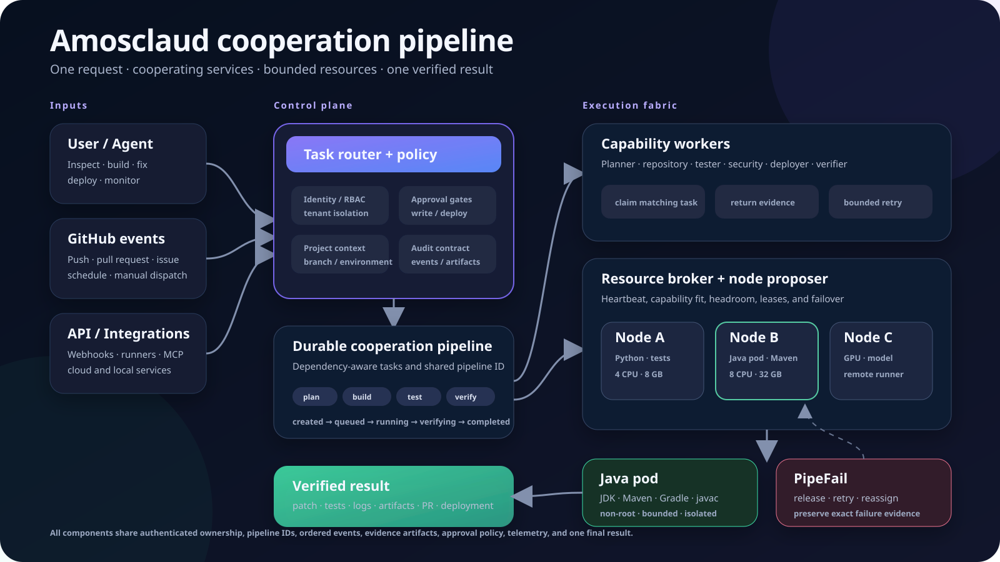
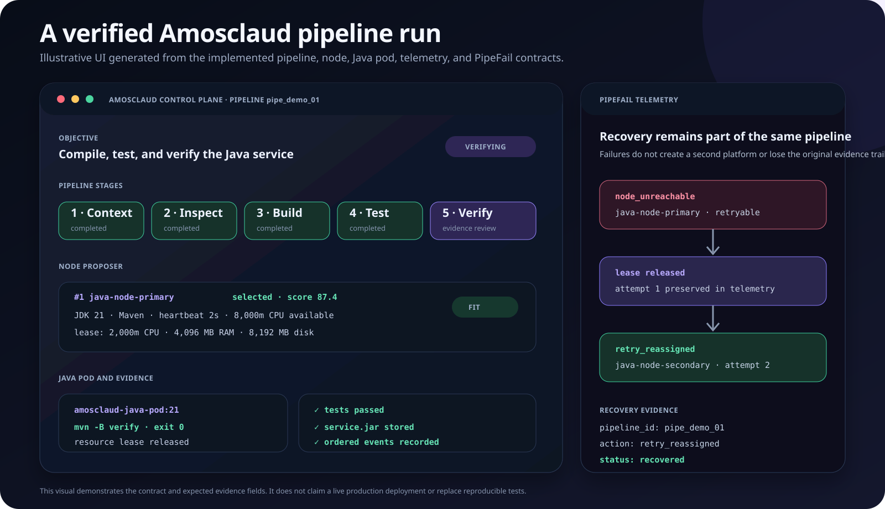

<div align="center">

# Amosclaud

**A self-hosted autonomous engineering control plane that turns repository requests into verified pipelines across agents, execution nodes, Java pods, tests, deployments, telemetry, and PipeFail recovery.**

[](https://github.com/wamakologeorge-dev/amosclaude-clean/actions/workflows/fast-pr-gate.yml)
[](https://github.com/wamakologeorge-dev/amosclaude-clean/actions/workflows/amosclaud-native-pipeline.yml)
[](https://www.python.org/)
[](pyproject.toml)
[](LICENSE)

[Quickstart](docs/QUICKSTART.md) · [Pipeline architecture](docs/PIPELINE_ECOSYSTEM.md) · [GitHub automation](docs/GITHUB_ACTIONS.md) · [Demo](docs/DEMO.md) · [Contributing](CONTRIBUTING.md)

</div>



## What Amosclaud solves

Software work is usually split across chat tools, CI systems, model providers, local machines, cloud runners, logs, and deployment dashboards. Amosclaud brings those systems into one auditable ecosystem:

- one request becomes one durable cooperation pipeline;
- specialized workers keep their own responsibilities while sharing tasks, events, artifacts, approvals, and capacity;
- execution nodes lend bounded CPU, memory, disk, GPU, and runtime capabilities through resource leases;
- Java work runs inside an isolated, non-root Java pod with Maven, Gradle-wrapper, or `javac` support;
- PipeFail records failure evidence, releases resources, retries bounded work, and can reassign it to a healthy node;
- protected repository writes, merges, and production deployments remain behind explicit policy and approval gates.

Amosclaud does not treat a process start as success. A pipeline result is complete only when the configured verification stages return evidence.

## Platform surfaces

The Control Plane is designed to unify Flags, Agent, AI Gateway, Sandboxes, Workflows, Images, Usage, Support, Settings, Logs, Analytics, Speed Insights, Observability, Firewall, CDN, Environment Variables, Domains, Connect, Integrations, and Storage.

Some modules are active today, some have a backend foundation, and others remain planned. The interface reports those states truthfully rather than displaying fabricated health.

## Five-minute local quickstart

### Prerequisites

- Python 3.11 or newer
- Git
- Docker with Docker Compose for the full self-hosted stack or Java pod runtime

```bash
git clone https://github.com/wamakologeorge-dev/amosclaude-clean.git
cd amosclaude-clean

python3 -m venv .venv
source .venv/bin/activate        # Windows PowerShell: .venv\Scripts\Activate.ps1
python -m pip install --upgrade pip
pip install -r requirements-dev.txt
pip install -e .
```

Get immediate, offline repository evidence without an account, API key, hosted model, or network request:

```bash
amosclaud-quick . --objective "Find the cause of the failing login tests"
```

Run the local API and web application:

```bash
python -m amoscloud_ai.main
```

Then open `http://127.0.0.1:8000`. In a development environment, the OpenAPI interface is available at `http://127.0.0.1:8000/docs`.

Run the repository validation contract:

```bash
make test
make quality
make build
```

See [the complete quickstart](docs/QUICKSTART.md) for Docker self-hosting, the Java pod image, connected runners, GitHub-native triggers, and safe configuration.

## Self-hosted stack

The source checkout includes a local compose stack with Amosclaud, Ollama, persistent storage, and an optional connected runner:

```bash
cp .env.example .env
mkdir -p AmosclaudWorkspace

docker compose -f docker-compose.selfhost.yml up -d
curl --fail http://127.0.0.1:8000/health
```

Build the Java execution image used by cooperation pipelines:

```bash
docker build -t amosclaud-java-pod:21 services/java-pod-runtime
```

The runtime launch contract applies non-root execution, a read-only root filesystem, dropped Linux capabilities, no-new-privileges, bounded resources, controlled mounts, and an explicit network policy.

## GitHub-native automation

`.github/workflows/amosclaud-native-pipeline.yml` routes these events into the same cooperation contract while preserving the repository's existing specialized workflows:

- pushes;
- pull requests opened, reopened, synchronized, or marked ready for review;
- issues opened, reopened, or labeled;
- a scheduled full-repository inspection;
- manual workflow dispatches;
- repository dispatches for inspect, build, fix, deploy, or monitor.

Automatic events never grant repository-write or deployment approval. See [GitHub Actions and required secrets](docs/GITHUB_ACTIONS.md).

## Verified flow



The diagram reflects the implemented contract: pipeline creation, worker and node selection, bounded leases, Java pod execution, evidence collection, verification, and PipeFail recovery. It is an architectural demo, not a fabricated production screenshot. Reproducible commands and expected evidence are documented in [docs/DEMO.md](docs/DEMO.md).

## Project status

Amosclaud is under active development. `main` is the only canonical product and deployment branch. Feature branches are temporary review lanes, and changes are not part of the product until required checks pass and the repository owner merges them.

The small `amosclaud-quick` command remains the safest first experience: it performs deterministic local inspection and never claims that an unfinished hosted capability is available.

## Documentation

- [Quickstart and self-hosting](docs/QUICKSTART.md)
- [Pipeline ecosystem and file responsibilities](docs/PIPELINE_ECOSYSTEM.md)
- [GitHub Actions and trigger behavior](docs/GITHUB_ACTIONS.md)
- [Telemetry, node proposer, and PipeFail graphics](docs/PIPELINE_ECOSYSTEM.md#telemetry-data-layouts)
- [Label taxonomy](docs/LABELS.md)
- [Reproducible demo](docs/DEMO.md)
- [Developer fast path](docs/DEVELOPER_FAST_PATH.md)
- [Production Docker deployment](docs/PRODUCTION_DOCKER.md)

## Contributing

Issues, tests, documentation, design work, runtime adapters, and infrastructure improvements are welcome. Read [CONTRIBUTING.md](CONTRIBUTING.md) before opening a pull request. Contributions should be focused, tested, evidence-backed, and compatible with the shared pipeline ecosystem rather than disabling another service to make one feature pass.

## License

Repository source code is available under the [MIT License](LICENSE). Separate [commercial service terms](LICENSE-COMMERCIAL.txt) apply only to paid, hosted, managed, supported, or enterprise Amosclaud offerings and do not remove rights already granted for MIT-licensed source code.
